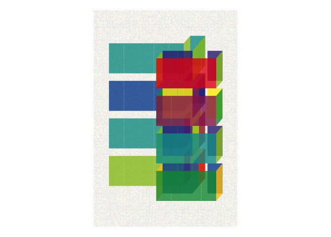
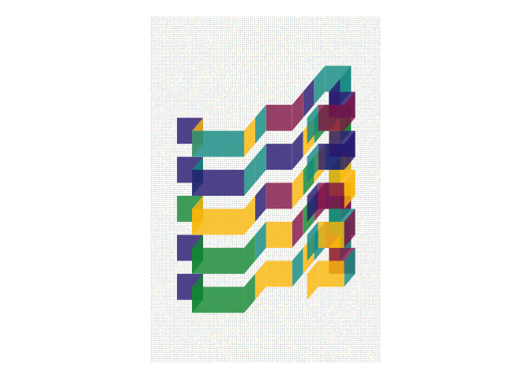
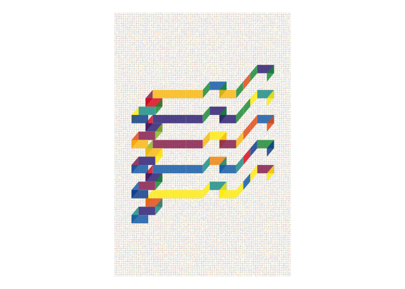
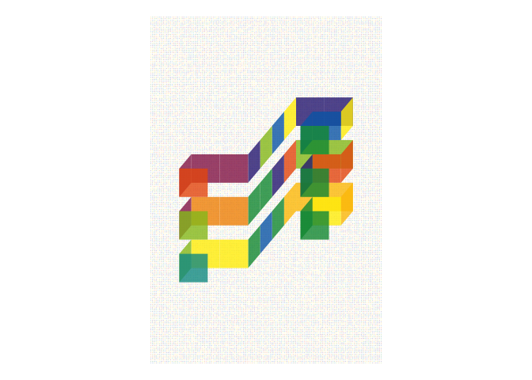

<!-- README.md is generated from README.Rmd. Please edit that file -->

# farbteiler

<!-- badges: start -->


<!-- badges: end -->

An R-package to generate art inspired by
[farbteiler](https://erikswahn.com/farbteiler/) by Erik Swahn. Erik
Swahn is the creator behind the system and this is just a mere
implementation of his idea based on available documentation of the
system. This library is for personal use only.

## Installation

You can install the released version of farbteiler from github:

``` r
remotes::install_github("mlhollestelle/farbteiler")
```

## Usage

Use the function `farbteiler()` to plot the object.

``` r
library(farbteiler)
farbteiler()
```


``` r
farbteiler()
```



``` r
farbteiler()
```



``` r
farbteiler()
```



``` r
farbteiler()
```


``` r
farbteiler()
```


